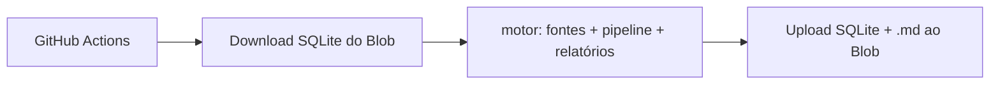

# Setup em nuvem — Financial Advisor

Produção: **https://financial-advisor-sable.vercel.app**  
Repositório: `Fabianocolombini/Financial_Advisor`

Este guia cobre o que roda na nuvem vs. local, e os passos para ativar login Google, crons Vercel e o motor Python automatizado.

---

## O que roda onde (após este setup)

| Componente | Onde | Trigger | Dados |
|------------|------|---------|-------|
| App Next.js (CRUD pessoal) | Vercel | Push em `main` (GitHub Action + Vercel) | Neon Postgres |
| Login Google | Vercel + Google Cloud | `AUTH_ENABLED=true` | Neon (`User`, `Session`) |
| `ingest-market` | Vercel Cron 11:00 UTC | `vercel.json` | `MarketSeries` / `MarketObservation` |
| `qi-macro` | Vercel Cron 11:15 UTC | `vercel.json` | `QiMacroSeries` / `QiMacroSeriesPoint` |
| **Motor Python** (`motor/`) | **GitHub Actions** 06:00 UTC | `.github/workflows/motor-daily.yml` | SQLite em **Vercel Blob** |
| Relatórios motor (`.md`) | Vercel Blob | upload pós-pipeline | `motor/reports/*.md` |

**Você não precisa** rodar `npm run motor:*` localmente em produção. O workflow baixa o SQLite do Blob, executa ingestão + pipeline + relatórios, e reenvia o banco atualizado.

---

## 1. Google OAuth (produção)

### 1.1 Google Cloud Console

1. Acesse [Google Cloud Console](https://console.cloud.google.com/) → **APIs e serviços** → **Credenciais**.
2. **Criar credenciais** → **ID do cliente OAuth 2.0**.
3. Tipo: **Aplicativo da Web**.
4. **URIs de redirecionamento autorizados** — adicione **exatamente**:

| Ambiente | URI |
|----------|-----|
| Produção | `https://financial-advisor-sable.vercel.app/api/auth/callback/google` |
| Local (opcional) | `http://localhost:3000/api/auth/callback/google` |

5. **Origens JavaScript autorizadas** (recomendado):

- `https://financial-advisor-sable.vercel.app`
- `http://localhost:3000`

6. Copie **ID do cliente** e **Chave secreta do cliente**.

### 1.2 Variáveis na Vercel

Defina em **Settings → Environment Variables → Production**:

| Variável | Valor |
|----------|-------|
| `AUTH_ENABLED` | `true` |
| `AUTH_URL` | `https://financial-advisor-sable.vercel.app` |
| `AUTH_GOOGLE_ID` | *(do Google Console)* |
| `AUTH_GOOGLE_SECRET` | *(do Google Console)* |
| `AUTH_SECRET` | `openssl rand -base64 32` *(já deve existir)* |

Via CLI (sem expor valores no terminal):

```bash
printf '%s' 'true' | vercel env add AUTH_ENABLED production
printf '%s' 'https://financial-advisor-sable.vercel.app' | vercel env add AUTH_URL production
# Cole ID e secret quando tiver:
printf '%s' 'SEU_CLIENT_ID' | vercel env add AUTH_GOOGLE_ID production
printf '%s' 'SEU_CLIENT_SECRET' | vercel env add AUTH_GOOGLE_SECRET production
```

> **Importante:** só ative `AUTH_ENABLED=true` **depois** de configurar `AUTH_GOOGLE_ID` e `AUTH_GOOGLE_SECRET`. Sem isso, as rotas protegidas exigem login mas não há provedor Google configurado.

### 1.3 Verificar login

1. Faça redeploy na Vercel (ou aguarde deploy após push).
2. Abra https://financial-advisor-sable.vercel.app
3. Deve redirecionar para `/auth/signin` → botão Google → volta ao painel.

---

## 2. Crons Vercel

Crons definidos em [`vercel.json`](../vercel.json):

| Path | Horário (UTC) | Função |
|------|---------------|--------|
| `/api/cron/ingest-market` | 11:00 | FRED + Yahoo → tabelas legacy |
| `/api/cron/qi-macro` | 11:15 | FRED → QI macro |

Todos exigem header `Authorization: Bearer $CRON_SECRET` (a Vercel envia automaticamente nos crons agendados).

### 2.1 Gerar e configurar `CRON_SECRET`

```bash
# Gerar (guarde o valor num gestor de senhas):
openssl rand -base64 32

# Na Vercel:
printf '%s' 'SEU_SECRET_GERADO' | vercel env add CRON_SECRET production
```

Também adicione `FRED_API_KEY` na Vercel (já configurada se seguiu setup anterior).

### 2.2 Testar manualmente

```bash
curl -s -H "Authorization: Bearer SEU_CRON_SECRET" \
  https://financial-advisor-sable.vercel.app/api/cron/ingest-market

curl -s -H "Authorization: Bearer SEU_CRON_SECRET" \
  https://financial-advisor-sable.vercel.app/api/cron/qi-macro
```

Resposta `401` = `CRON_SECRET` ausente ou incorreto na Vercel.

---

## 3. Motor Python (GitHub Actions + Vercel Blob)

O motor usa Python + SQLite (`motor/data/historico.db`). A Vercel **não** executa pipelines Python longos — o workflow [`.github/workflows/motor-daily.yml`](../.github/workflows/motor-daily.yml) faz isso.

### 3.1 Fluxo diário (06:00 UTC)



Passos do workflow:

1. `python motor/scripts/blob_sync.py download` — restaura `historico.db` (ignora 404 na primeira execução).
2. `python motor/scripts/run_daily.py` — ingestão de fontes, pipeline de todas as abas (`fi_treasury`, `credito_alternativo`, …), relatórios `.md`.
3. `python motor/scripts/blob_sync.py upload` — persiste SQLite.
4. `python motor/scripts/blob_sync.py upload-reports` — envia relatórios para `motor/reports/`.

### 3.2 Vercel Blob

1. No painel Vercel do projeto **financial-advisor** → **Storage** → **Create Database/Store** → **Blob**.
2. Copie o token **Read-Write** (`BLOB_READ_WRITE_TOKEN`).

### 3.3 Secrets no GitHub

Em **GitHub → Settings → Secrets and variables → Actions** do repositório `Financial_Advisor`:

| Secret | Descrição |
|--------|-----------|
| `FRED_API_KEY` | Chave FRED (mesma da Vercel) |
| `BLOB_READ_WRITE_TOKEN` | Token Vercel Blob Read-Write |

### 3.4 Ativar o workflow

1. **Commit e push** dos ficheiros `.github/workflows/motor-daily.yml` e `motor/scripts/*` para `main`.
2. Em **Actions → Motor Daily → Run workflow** para teste manual.
3. Verifique logs: download → pipeline → upload sem erros.

### 3.5 Disparo opcional via Vercel

Rota `GET /api/cron/motor` dispara o mesmo workflow via GitHub API (útil para reprocessar sem abrir o GitHub).

Variáveis Vercel adicionais:

| Variável | Descrição |
|----------|-----------|
| `GITHUB_MOTOR_DISPATCH_TOKEN` | PAT GitHub com scope `repo` + `workflow` |
| `GITHUB_REPO` | `Fabianocolombini/Financial_Advisor` |

```bash
curl -s -H "Authorization: Bearer SEU_CRON_SECRET" \
  https://financial-advisor-sable.vercel.app/api/cron/motor
```

---

## 4. Tabela completa de variáveis

### Vercel (Production)

| Variável | Obrigatório | Notas |
|----------|-------------|-------|
| `DATABASE_URL` | Sim | Neon Postgres |
| `AUTH_SECRET` | Sim | `openssl rand -base64 32` |
| `FRED_API_KEY` | Sim | Crons + motor (via GH) |
| `CRON_SECRET` | Sim | Protege `/api/cron/*` |
| `AUTH_ENABLED` | Para login | `true` só com Google configurado |
| `AUTH_URL` | Com auth | URL pública da app |
| `AUTH_GOOGLE_ID` | Com auth | Google Console |
| `AUTH_GOOGLE_SECRET` | Com auth | Google Console |
| `GITHUB_MOTOR_DISPATCH_TOKEN` | Opcional | Disparo manual motor via Vercel |
| `GITHUB_REPO` | Opcional | `Fabianocolombini/Financial_Advisor` |
| `POLYGON_API_KEY`, `FMP_API_KEY`, `QI_*` | Opcional | QI Python (legado) |

### GitHub Actions secrets

| Secret | Obrigatório |
|--------|-------------|
| `FRED_API_KEY` | Sim |
| `BLOB_READ_WRITE_TOKEN` | Sim |

---

## 4. Deploy Vercel em cada push (`main`)

GitHub Actions: `.github/workflows/vercel-deploy.yml` (backup se a integração Git da Vercel parar).

### 4.1 Secret obrigatório no GitHub

1. [Vercel → Account → Tokens](https://vercel.com/account/settings/tokens) → Create Token (scope: deploy).
2. Repositório GitHub → **Settings** → **Secrets and variables** → **Actions** → **New repository secret**:
   - Nome: `VERCEL_TOKEN`
   - Valor: o token criado

Sem este secret, o workflow **Vercel Production Deploy** falha; use `vercel --prod` local ou reconecte o Git na Vercel.

### 4.2 Reconectar Git na Vercel (recomendado)

Vercel → projeto **financial-advisor** → **Settings** → **Git** → confirmar repo `Fabianocolombini/Financial_Advisor`, branch `main`, **Production Branch** = `main`. Se desconectado, **Connect Git Repository** e redeploy.

### 4.3 Deploy manual (emergência)

```bash
vercel link   # se necessário
vercel --prod
```

---

## 5. O que permanece local

| Tarefa | Quando local |
|--------|--------------|
| `npm run dev` | Desenvolvimento UI |
| `npx prisma migrate dev` | Novas migrations (use URL direta Neon) |
| `npm run motor:*` | Debug do motor antes de validar na nuvem |
| Editar configs `motor/config/abas/*.json` | Commit → próximo run GH Actions aplica |

---

## 6. Checklist de verificação

**Checklist completo** (onde cada dado mora, queries Neon, troubleshooting): [CLOUD_VERIFICATION_CHECKLIST.md](CLOUD_VERIFICATION_CHECKLIST.md).

- [ ] Secret `VERCEL_TOKEN` no GitHub (deploy automático em cada push)
- [ ] Login Google funciona em https://financial-advisor-sable.vercel.app
- [ ] `CRON_SECRET` definido na Vercel; crons `ingest-market` e `qi-macro` retornam 200
- [ ] Blob store criado na Vercel; `BLOB_READ_WRITE_TOKEN` no GitHub
- [ ] Workflow **Motor Daily** executado com sucesso (manual ou agendado)
- [ ] Blob contém `motor/historico.db` após primeira execução
- [ ] Relatórios em `motor/reports/` no Blob (se pipeline gerou scores)

---

## 7. Troubleshooting

| Sintoma | Causa provável | Ação |
|---------|----------------|------|
| 401 nos crons | `CRON_SECRET` ausente na Vercel | Definir e redeploy |
| Login sem botão Google | `AUTH_GOOGLE_*` ausentes | Google Console + env vars Vercel |
| `error=Configuration` após clicar Google | `AUTH_SECRET` ou `DATABASE_URL` vazios na Vercel | Restaurar ambos e redeploy; limpar cookies do site |
| Login Google ok mas volta ao signin | `DATABASE_URL` apontando a localhost ou vazio | Neon URL em Production + redeploy |
| Loop de login | `AUTH_URL` incorreto | Deve ser URL exata da produção |
| Motor workflow falha no download | Primeira execução (blob vazio) | Normal — pipeline cria DB novo |
| Motor workflow falha no upload | `BLOB_READ_WRITE_TOKEN` inválido | Recriar token no painel Blob |
| Commits no GitHub mas Vercel não builda | Integração Git desconectada | Reconectar Git na Vercel (§4.2) ou adicionar `VERCEL_TOKEN` (§4.1) |
| Workflow `Vercel Production Deploy` falha | `VERCEL_TOKEN` ausente no GitHub | Criar token Vercel + secret no repo |
| `FRED_API_KEY não definida` | Secret GitHub ausente | Adicionar em repo secrets |

---

*Documentação relacionada: [CLOUD_VERIFICATION_CHECKLIST.md](CLOUD_VERIFICATION_CHECKLIST.md) (verificação pós-setup), [SETUP.md](SETUP.md) (local), [ENVIRONMENT.md](ENVIRONMENT.md) (variáveis), [MOTOR_EXECUCAO.md](MOTOR_EXECUCAO.md) (etapas do motor).*
