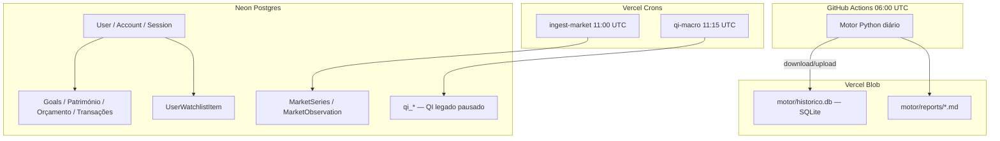

# Checklist de verificação em nuvem — Financial Advisor

Produção: **https://financial-advisor-sable.vercel.app**  
Repositório: `Fabianocolombini/Financial_Advisor`

Use este guia para confirmar que **autenticação**, **motor Python**, **crons** e **dados** estão realmente a correr na nuvem — e para perceber **onde cada tipo de dado vive** (nem tudo está no Neon).

Documentação relacionada: [CLOUD_SETUP.md](CLOUD_SETUP.md) (setup inicial), [ENVIRONMENT.md](ENVIRONMENT.md) (variáveis).

---

## Onde cada dado mora

> **Importante:** o utilizador pensa que “tudo está no Neon”. Na realidade, o **motor MVP** guarda histórico em **SQLite no Vercel Blob**. O Neon concentra a app Next.js, auth e dados QI/legacy.

### Diagrama



### Tabela resumo

| Dado | Onde | Atualizado por | Notas |
|------|------|----------------|-------|
| Login Google (`User`, `Account`, `Session`) | **Neon** | Login do utilizador | Só com `AUTH_ENABLED=true` |
| Metas, património, orçamento, transações | **Neon** | App Next.js (utilizador) | CRUD pessoal |
| Watchlist (`user_watchlist_item`) | **Neon** | App Next.js | Símbolos favoritos |
| `MarketSeries` / `MarketObservation` | **Neon** | Cron Vercel `ingest-market` | FRED + Yahoo (legacy TS) |
| `qi_macro_series` / `qi_macro_series_point` | **Neon** | Cron Vercel `qi-macro` | FRED macro (QI legado) |
| `qi_asset`, `qi_market_price_daily`, scores QI, etc. | **Neon** | Pipeline Python QI (**pausado**) | Dados podem estar desatualizados |
| `raw_series`, `price_daily`, `scores_historico`, … | **SQLite** (`motor/data/historico.db`) | GitHub Actions `motor-daily` | Persistido no **Vercel Blob** |
| Relatórios motor (`relatorio_*.md`) | **Vercel Blob** (`motor/reports/`) | GitHub Actions pós-pipeline | Não estão no Neon |
| Código e configs (`motor/config/abas/*.json`) | **Git** | Deploy / próximo run GH | Não são “dados” em si |

### O que **não** está no Neon

| Item | Onde está |
|------|-----------|
| Séries brutas do motor (`raw_series`) | SQLite → Blob |
| Preços diários do motor (`price_daily`) | SQLite → Blob |
| Scores compostos por aba (`scores_historico`, `scores_ativo`) | SQLite → Blob |
| Métricas EDGAR / indicadores técnicos do motor | SQLite → Blob |
| Relatórios `.md` do motor | Vercel Blob |

---

## Autenticação Google

### Pré-requisitos (Vercel Production)

| Variável | Obrigatório |
|----------|-------------|
| `AUTH_ENABLED` | `true` |
| `AUTH_URL` | `https://financial-advisor-sable.vercel.app` |
| `AUTH_GOOGLE_ID` | ID do cliente OAuth (Google Console) |
| `AUTH_GOOGLE_SECRET` | Secret do cliente OAuth |
| `AUTH_SECRET` | `openssl rand -base64 32` |
| `DATABASE_URL` | Connection string Neon |

No **Google Cloud Console**, o redirect URI de produção deve ser **exatamente**:

`https://financial-advisor-sable.vercel.app/api/auth/callback/google`

### Passos de verificação

1. **Redeploy** após alterar variáveis de auth na Vercel.
2. Abra https://financial-advisor-sable.vercel.app numa janela anónima.
3. Rotas protegidas (`/`, `/patrimonio`, `/objetivos`, `/orcamento`) devem redirecionar para `/auth/signin`.
4. Deve aparecer o botão **Google** (só se `AUTH_GOOGLE_ID` e `AUTH_GOOGLE_SECRET` estiverem definidos).
5. Após login, o painel carrega e a sessão persiste ao recarregar.

### Testes técnicos

**Browser (recomendado):** fluxo completo sign-in → redirect → dashboard.

**curl — página de sign-in (sem auth):**

```bash
curl -sI https://financial-advisor-sable.vercel.app/patrimonio | grep -i location
```

Esperado com `AUTH_ENABLED=true`: header `Location` apontando para `/auth/signin` (ou URL com callback).

**curl — endpoint de sessão (após login no browser, copiar cookie):**

```bash
curl -s https://financial-advisor-sable.vercel.app/api/auth/session \
  -H "Cookie: SEU_COOKIE_DE_SESSAO"
```

Esperado: JSON com `user.email`, `user.name` (não `{}` vazio).

**Neon — utilizador criado após primeiro login:**

```sql
SELECT id, email, name, "emailVerified"
FROM "User"
ORDER BY id DESC
LIMIT 5;
```

```sql
SELECT COUNT(*) AS sessions_ativas
FROM "Session"
WHERE expires > NOW();
```

### Sinais de problema

| Sintoma | Causa provável |
|---------|----------------|
| Sem botão Google | `AUTH_GOOGLE_*` ausentes na Vercel |
| Loop de login | `AUTH_URL` incorreto (deve ser URL exata de produção) |
| 401 / sessão vazia | `AUTH_SECRET` diferente entre deploys |
| Redirect mas erro OAuth | Redirect URI no Google Console não coincide |

---

## Motor Python na nuvem

O motor **não corre na Vercel**. Corre em **GitHub Actions** (`.github/workflows/motor-daily.yml`), agenda **06:00 UTC** diariamente, com disparo manual opcional.

### Fluxo diário

1. `blob_sync.py download` — restaura `historico.db` do Blob (404 na 1.ª execução é normal).
2. `run_daily.py` — ingestão de fontes + pipeline de todas as abas + relatórios.
3. `blob_sync.py upload` — envia SQLite atualizado.
4. `blob_sync.py upload-reports` — envia `relatorio_*.md` para `motor/reports/`.

### Secrets GitHub (Actions)

| Secret | Função |
|--------|--------|
| `FRED_API_KEY` | Ingestão FRED no motor |
| `BLOB_READ_WRITE_TOKEN` | Leitura/escrita no Vercel Blob |

### Como verificar

**1. Últimas execuções do workflow:**

```bash
gh run list --workflow=motor-daily.yml --limit 5
```

**2. Logs da última run (substitua RUN_ID):**

```bash
gh run view RUN_ID --log
```

Procure: `Download OK`, `Upload OK`, `Relatório →`, sem `ERRO` ou exit code 1.

**3. Disparo manual (GitHub UI):**  
Actions → **Motor Daily** → **Run workflow** → branch `main`.

**4. Disparo via Vercel (opcional):**  
Requer `GITHUB_MOTOR_DISPATCH_TOKEN` + `GITHUB_REPO` na Vercel.

```bash
curl -s -H "Authorization: Bearer SEU_CRON_SECRET" \
  https://financial-advisor-sable.vercel.app/api/cron/motor
```

Esperado: `{"ok":true,"message":"Workflow motor-daily disparado",...}`  
Se `503`: secrets GitHub não configurados na Vercel (o schedule GH continua a funcionar sem isto).

**5. Blob contém o SQLite:**

- Painel Vercel → projeto → **Storage** → Blob store → procurar `motor/historico.db`.
- Ou localmente (com token, **não commitar**):

```bash
BLOB_READ_WRITE_TOKEN=... python motor/scripts/blob_sync.py download
ls -la motor/data/historico.db
sqlite3 motor/data/historico.db "SELECT COUNT(*) FROM raw_series;"
sqlite3 motor/data/historico.db "SELECT MAX(data) FROM scores_historico;"
```

**6. Relatórios no Blob:**  
Ficheiros `motor/reports/relatorio_*.md` com data recente.

---

## Crons Vercel

Definidos em [`vercel.json`](../vercel.json). Todos os endpoints `/api/cron/*` exigem:

```
Authorization: Bearer $CRON_SECRET
```

A Vercel envia este header automaticamente nos crons agendados. Chamadas manuais precisam do mesmo header.

### Crons agendados (produção)

| Path | Schedule (UTC) | Horário local (BRT, UTC−3) | Função |
|------|----------------|----------------------------|--------|
| `/api/cron/ingest-market` | `0 11 * * *` | 08:00 | FRED + Yahoo → `MarketSeries` / `MarketObservation` |
| `/api/cron/qi-macro` | `15 11 * * *` | 08:15 | FRED → `qi_macro_series` / `qi_macro_series_point` |

### Motor (GitHub Actions, não Vercel Cron)

| Trigger | Schedule (UTC) | Função |
|---------|----------------|--------|
| `.github/workflows/motor-daily.yml` | `0 6 * * *` (06:00) | Pipeline motor completo |
| `/api/cron/motor` | Manual (via curl) | Dispara workflow GH |

### Rotas existentes mas **não agendadas** em `vercel.json`

| Path | Estado | Notas |
|------|--------|-------|
| `/api/cron/qi-pipeline` | Desativado por defeito | Precisa `QI_RUN_PYTHON=true`; Python indisponível na Vercel serverless |
| `/api/cron/qi-regime` | Manual; escritores TS bloqueados | `QI_ALLOW_TS_QI_WRITERS` não definido |
| `/api/cron/qi-sectors` | Manual; escritores TS bloqueados | Idem |
| `/api/cron/qi-recommend` | Manual; escritores TS bloqueados | Idem |

### Verificar `CRON_SECRET`

**Sem secret (deve falhar 401):**

```bash
curl -s -o /dev/null -w "%{http_code}" \
  https://financial-advisor-sable.vercel.app/api/cron/ingest-market
```

Esperado: `401`

**Com secret correto (deve retornar 200 ou 207):**

```bash
curl -s -H "Authorization: Bearer SEU_CRON_SECRET" \
  https://financial-advisor-sable.vercel.app/api/cron/ingest-market | jq .
```

```bash
curl -s -H "Authorization: Bearer SEU_CRON_SECRET" \
  https://financial-advisor-sable.vercel.app/api/cron/qi-macro | jq .
```

Respostas úteis:
- `401` → `CRON_SECRET` ausente ou incorreto na Vercel
- `500` + `"FRED_API_KEY não configurada"` → falta `FRED_API_KEY` na Vercel
- `200` / `207` com `ok: true` ou séries processadas → cron funcional

**Logs Vercel:**  
Dashboard → projeto → **Logs** → filtrar por `/api/cron/` após o horário agendado.

---

## Neon — queries de verificação

Execute no **Neon SQL Editor** ou via `psql` com `DATABASE_URL` (nunca partilhe a URL em chats públicos).

### Auth e dados pessoais

```sql
-- Utilizadores registados
SELECT COUNT(*) AS total_users FROM "User";

-- Sessões ativas
SELECT COUNT(*) AS sessions_ativas
FROM "Session"
WHERE expires > NOW();

-- Watchlist
SELECT COUNT(*) AS watchlist_items FROM user_watchlist_item;

-- Metas / património / orçamento
SELECT
  (SELECT COUNT(*) FROM "Goal") AS goals,
  (SELECT COUNT(*) FROM "BalanceItem") AS balance_items,
  (SELECT COUNT(*) FROM "BudgetCategory") AS budget_categories,
  (SELECT COUNT(*) FROM "Transaction") AS transactions;
```

### Dados de mercado (crons Vercel)

```sql
-- Legacy ingest-market
SELECT COUNT(*) AS market_series FROM "MarketSeries";
SELECT COUNT(*) AS observations FROM "MarketObservation";
SELECT MAX("observedAt") AS ultima_observacao FROM "MarketObservation";

-- QI macro (cron qi-macro)
SELECT COUNT(*) AS macro_series FROM qi_macro_series;
SELECT COUNT(*) AS macro_points FROM qi_macro_series_point;
SELECT MAX(observed_on) AS ultimo_ponto FROM qi_macro_series_point;
```

### QI legado (pode estar desatualizado)

```sql
SELECT COUNT(*) AS assets FROM qi_asset;
SELECT COUNT(*) AS prices FROM qi_market_price_daily;
SELECT MAX(trade_date) AS ultimo_preco FROM qi_market_price_daily;

-- Últimos jobs de ingestão QI
SELECT job_name, status, started_at, finished_at, rows_upserted
FROM qi_ingestion_job
ORDER BY created_at DESC
LIMIT 10;
```

### Interpretação

| Resultado | Significado |
|-----------|-------------|
| `User` > 0 após login Google | Auth persiste no Neon |
| `MarketObservation` com data recente | `ingest-market` a correr |
| `qi_macro_series_point` com data recente | `qi-macro` a correr |
| `qi_market_price_daily` antigo | Normal — pipeline Polygon Python está **pausado** |
| Motor scores ausentes no Neon | Normal — scores do motor estão no **SQLite/Blob** |

---

## Checklist rápido — “Estou 100% cloud?”

Marque cada item após verificar.

### Infraestrutura

- [ ] Projeto Vercel ligado ao repo `Fabianocolombini/Financial_Advisor`
- [ ] `DATABASE_URL` (Neon) definida na Vercel Production
- [ ] `FRED_API_KEY` na Vercel Production
- [ ] `CRON_SECRET` na Vercel Production
- [ ] Blob store criado na Vercel
- [ ] `BLOB_READ_WRITE_TOKEN` nos secrets GitHub Actions
- [ ] `FRED_API_KEY` nos secrets GitHub Actions

### Autenticação

- [ ] Google OAuth configurado (redirect URI correto)
- [ ] `AUTH_ENABLED=true` na Vercel
- [ ] `AUTH_URL`, `AUTH_GOOGLE_ID`, `AUTH_GOOGLE_SECRET`, `AUTH_SECRET` definidos
- [ ] Login Google funciona em produção
- [ ] `User` e `Session` aparecem no Neon após login

### Motor Python

- [ ] Workflow **Motor Daily** executou com sucesso (últimas 24–48 h)
- [ ] Blob contém `motor/historico.db` (tamanho > 0)
- [ ] `raw_series` e/ou `scores_historico` têm dados recentes no SQLite
- [ ] Relatórios `motor/reports/relatorio_*.md` no Blob (se pipeline gerou scores)

### Crons e atualização de dados

- [ ] `ingest-market` retorna 200/207 com `CRON_SECRET` válido
- [ ] `qi-macro` retorna 200/207 com `CRON_SECRET` válido
- [ ] Logs Vercel mostram execuções nos horários 11:00 e 11:15 UTC
- [ ] `MarketObservation` e `qi_macro_series_point` têm datas recentes no Neon

### Expectativas realistas

- [ ] Percebo que **dados do motor** estão no **Blob**, não no Neon
- [ ] Percebo que **QI preços/análise** (`qi_market_price_daily`, regime, setores) **não** atualizam automaticamente em cloud (QI pausado)
- [ ] Não dependo de `npm run motor:*` local para produção

---

## Garantir que tudo corre e permanece atualizado

### Calendário diário (UTC)

| Hora UTC | Componente | O que atualiza |
|----------|------------|----------------|
| 06:00 | GitHub Actions `motor-daily` | SQLite motor + relatórios Blob |
| 11:00 | Vercel `ingest-market` | `MarketSeries` / `MarketObservation` (Neon) |
| 11:15 | Vercel `qi-macro` | `qi_macro_series*` (Neon) |

### Monitorização recomendada

1. **GitHub Actions** — ativar notificações de falha no workflow `Motor Daily`.
2. **Vercel** — rever logs de cron após 11:15 UTC; configurar alertas de deploy se disponível.
3. **Neon** — query semanal nas datas máximas de `MarketObservation` e `qi_macro_series_point`.
4. **Blob** — confirmar `historico.db` com `last modified` recente no painel Vercel.

### O que fazer se um dia falhar

| Componente | Ação |
|------------|------|
| Motor GH Actions | Actions → Motor Daily → Re-run failed jobs |
| Motor (alternativa) | `curl` em `/api/cron/motor` (se dispatch configurado) |
| Crons Vercel | `curl` manual com `CRON_SECRET` nos endpoints |
| Auth | Verificar env vars + redirect URI Google; redeploy |

### Alterações de config do motor

Editar `motor/config/abas/*.json` ou `fontes_manifest.json` → commit → push → **próximo run às 06:00 UTC** aplica (ou disparo manual).

---

## Troubleshooting comum

| Sintoma | Causa provável | Ação |
|---------|----------------|------|
| 401 em `/api/cron/*` | `CRON_SECRET` ausente ou errado | `vercel env ls` → corrigir → redeploy |
| Cron 500 `FRED_API_KEY` | Chave ausente na Vercel | Adicionar `FRED_API_KEY` Production |
| Login sem Google | `AUTH_GOOGLE_*` ausentes | Google Console + env vars Vercel |
| Loop de login | `AUTH_URL` errado | Deve ser `https://financial-advisor-sable.vercel.app` |
| Motor GH falha no download | 1.ª execução (blob vazio) | Normal; pipeline cria DB novo |
| Motor GH falha no upload | `BLOB_READ_WRITE_TOKEN` inválido | Recriar token Blob; atualizar secret GH |
| `FRED_API_KEY não definida` (GH) | Secret GitHub ausente | Settings → Secrets → Actions |
| Scores motor invisíveis na app | Motor ainda não ligado ao Next.js | Esperado no MVP; dados estão no Blob |
| `qi_market_price_daily` parado | QI Python pausado | Não é regressão do motor; ver `ESTADO_DO_PROJETO.md` |
| `/api/cron/motor` → 503 | Dispatch não configurado | Opcional; schedule GH às 06:00 UTC basta |
| `/api/cron/qi-pipeline` skipped | `QI_RUN_PYTHON` não é `true` | Esperado na Vercel serverless |

---

## Comandos úteis

> **Nunca** cole valores de secrets (`CRON_SECRET`, tokens, `DATABASE_URL`) em issues, chats ou commits.

### Vercel CLI

```bash
vercel link                    # associar projeto local
vercel env ls                  # listar nomes de variáveis (não mostra valores)
vercel env ls production       # só Production
vercel logs --follow           # logs em tempo real
vercel inspect                 # último deployment
```

### GitHub CLI

```bash
gh workflow list
gh run list --workflow=motor-daily.yml --limit 10
gh run view RUN_ID
gh run view RUN_ID --log
gh workflow run motor-daily.yml --ref main   # disparo manual
```

### Testes de cron (substitua o secret localmente)

```bash
export CRON_SECRET='...'   # do gestor de senhas, não do git

curl -s -w "\nHTTP %{http_code}\n" \
  -H "Authorization: Bearer $CRON_SECRET" \
  https://financial-advisor-sable.vercel.app/api/cron/ingest-market

curl -s -w "\nHTTP %{http_code}\n" \
  -H "Authorization: Bearer $CRON_SECRET" \
  https://financial-advisor-sable.vercel.app/api/cron/qi-macro

curl -s -w "\nHTTP %{http_code}\n" \
  -H "Authorization: Bearer $CRON_SECRET" \
  https://financial-advisor-sable.vercel.app/api/cron/motor
```

### Motor / Blob (local, com token)

```bash
pip install -r motor/requirements.txt
BLOB_READ_WRITE_TOKEN=... python motor/scripts/blob_sync.py download
sqlite3 motor/data/historico.db ".tables"
sqlite3 motor/data/historico.db "SELECT fonte, status, records FROM ingestion_log ORDER BY id DESC LIMIT 5;"
```

### Neon (psql)

```bash
# Usar connection string do painel Neon (não commitar)
psql "$DATABASE_URL" -c "SELECT COUNT(*) FROM \"User\";"
psql "$DATABASE_URL" -c "SELECT MAX(\"observedAt\") FROM \"MarketObservation\";"
```

### Verificar auth no browser

1. https://financial-advisor-sable.vercel.app/auth/signin  
2. DevTools → Application → Cookies → verificar cookie de sessão após login  
3. https://financial-advisor-sable.vercel.app/api/auth/session → JSON com utilizador

---

## Referência rápida de variáveis

### Vercel Production (essenciais)

| Variável | Componente |
|----------|------------|
| `DATABASE_URL` | Neon / Prisma |
| `AUTH_SECRET`, `AUTH_ENABLED`, `AUTH_URL`, `AUTH_GOOGLE_*` | Google OAuth |
| `FRED_API_KEY` | Crons `ingest-market`, `qi-macro` |
| `CRON_SECRET` | Proteção `/api/cron/*` |
| `GITHUB_MOTOR_DISPATCH_TOKEN`, `GITHUB_REPO` | Opcional: `/api/cron/motor` |

### GitHub Actions secrets

| Secret | Componente |
|--------|------------|
| `FRED_API_KEY` | Motor ingestão |
| `BLOB_READ_WRITE_TOKEN` | Sync SQLite + relatórios |

---

*Última revisão alinhada com `vercel.json`, `motor-daily.yml` e schemas Prisma/SQLite do repositório.*
