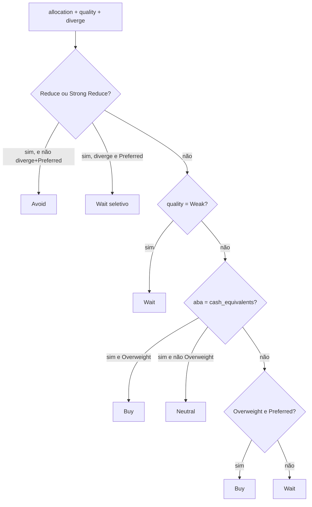

# Timing de entrada do motor — regra por classe

Documento da **regra que o motor grava** em `entryTiming` (Buy / Wait / Avoid / Neutral).  
É o que a coluna **Money** da tabela Markets mostra (`+` Can add, `…` Wait, `×` Do not add, `~` Indifferent).

Não descreve 1D/7D, nem Bollinger da página do ticker. Isso vem depois, no app.

**Código:** `motor/src/decisao/validacao.py` (`_entry_timing`, `validate_ticker_entry`) · limiares em `motor/src/decisao/score_domain.py`.  
**Racional qualitativo antigo** (VIX, spreads, curva — o que *alimenta* o regime, não a árvore): [guia-decisao-entrada-por-sleeve.md](guia-decisao-entrada-por-sleeve.md).  
**Receita do ranking do papel:** [score-recipes](../lib/motor/score-recipes.ts) e `motor/config/models/*_regime.json`.

---

## 1. O que a regra responde

Três perguntas, nesta ordem:

1. **Sleeve** — a classe deve receber mais peso ou menos? (`allocationAction`)
2. **Papel** — este nome é um bom veículo *dentro* da classe? (`instrumentQuality`)
3. **Timing** — posso colocar **dinheiro novo** neste nome agora? (`entryTiming`)

O motor **não** prevê se o preço sobe. Um dia +7% com Money `×` é preço, não entrada.

Há um booleano à parte, `entryValidated`: elegibilidade (papel na mediana ou acima, sleeve não em Reduce, salvo divergência). **Não** é ordem de compra. A UI de Markets usa `entryTiming` quando existe.

---

## 2. Insumos (iguais para as 17 classes unitárias)

Todas as abas em `_CLASS_MODEL_ABAS` (`motor/src/config_loader.py`) usam domínio **unit** (ranking 0–1). Só uma aba inexistente / legado cai no domínio **signed**.

### 2.1 Alocação da classe

Vem do **Regime Score** da aba (ação do modelo, senão limiar no score de regime):

| Score de regime | `allocationAction` | Trend na UI |
|-----------------|--------------------|-------------|
| ≥ 0.65 | Overweight | Increase `↑` |
| ≥ 0.45 | Hold | Hold `●` |
| ≥ 0.25 | Reduce | Reduce `↓` |
| < 0.25 | Strong Reduce | Reduce hard `⇊` |

Labels de modelos de ritmo (FX: Acelerar / Pausar / Reverter) são normalizados para essa escala de quatro valores.

O **conteúdo** do Regime Score muda por classe (VIX, OAS, TIPS, DXY…). A **árvore de timing não lê esses indicadores**. Ela só lê Overweight / Hold / Reduce / Strong Reduce.

### 2.2 Qualidade do papel

Vem do **Security Score** (ranking cruzado no dia, 0.5 = mediana da classe):

| Score do papel | `instrumentQuality` |
|----------------|---------------------|
| ≥ 0.65 | Preferred |
| ≥ 0.25 | Competitive |
| < 0.25 | Weak |

Um Preferred em Metals não é “melhor” que um Preferred em Cash. Só diz: entre os pares *desta* classe, está no topo.

### 2.3 Divergência positiva

`diverge_categoria` em `motor/src/decisao/estagio.py`:

- estágios opostos (classe Descendente × papel Ascendente, ou o inverso), **ou**
- classe fraca (score < −0.1) e papel materialmente melhor (score > 0.15), ou o espelho.

Só abre uma **exceção seletiva** quando o sleeve está em Reduce: nunca vira Buy no motor; no máximo Wait.

---

## 3. Árvore canónica (`_entry_timing`)

Avaliação **nesta ordem**; a primeira que casar ganha.

Em texto:

1. **Reduce / Strong Reduce** → **Avoid**, salvo divergência **e** Preferred → **Wait**.
2. **Weak** → **Wait** (há pares melhores na mesma classe).
3. **Cash** (`is_stability_focused`) — ver secção 5.
4. **Overweight e Preferred** → **Buy**.
5. Qualquer outro caso construtivo (Hold + Preferred, Overweight + Competitive, etc.) → **Wait**. O motor declara que **não tem confirmação de preço**; isso fica para o app.

Tradução Money:

| `entryTiming` | Money | Significado |
|---------------|-------|-------------|
| Buy | `+` Can add | Elegível para caixa nova — não é garantia de retorno |
| Wait | `…` Wait | Não adicione ainda; o preço ainda pode subir |
| Avoid | `×` Do not add | Não entre agora; quem já tem não é forçado a vender só por isso |
| Neutral | `~` Indifferent | Só caixa: timing de preço não existe |

---

## 4. Matriz (todas as classes, menos a exceção Cash)

| ↓ qualidade \\ alocação → | Overweight | Hold | Reduce / Strong Reduce |
|---------------------------|------------|------|-------------------------|
| Preferred | **Buy** | Wait | Avoid (Wait se diverge) |
| Competitive | Wait | Wait | Avoid |
| Weak | Wait | Wait | Avoid |

Única célula **Buy** no motor, fora do cash: **Overweight ∩ Preferred**.

Hold + Preferred = Wait. A classe não pede mais peso; o papel é bom, mas o motor não confirma entrada.

---

## 5. Exceção: Cash (`cash_equivalents`)

Única aba `STABILITY_FOCUSED`. NAV é estável por construção. RSI / esticamento de preço **não** são ponto de entrada.

Depois dos vetos Reduce e Weak:

| Alocação | Timing |
|----------|--------|
| Overweight | **Buy** — aportar conforme necessidade de liquidez |
| Hold (e o resto construtivo) | **Neutral** — esperar custa carry, não reduz risco |
| Reduce | **Avoid** (árvore geral) |

Cash **nunca** cai no “Wait por falta de confirmação de preço”. Ou Neutral, ou Buy, ou os vetos.

`entryValidated` em cash (domínio unit): papel ≥ mediana (0.5) e sleeve não em Reduce. Um Preferred com Hold pode estar Validated **e** Neutral ao mesmo tempo: elegível como veículo, sem janela de preço.

---

## 6. `entryValidated` (elegibilidade, não timing)

Domínio **unit** (as 17 classes):

- papel ≥ 0.50 (mediana), e
- sleeve **não** é Reduce / Strong Reduce, **salvo** diverge e score ≥ 0.65.

Domínio **signed** (aba desconhecida / legado): regras de estágio do guia antigo (Ascendente / Maduro / Descendente no z-score). Não é o caminho das 17 tabs.

Validated + Wait é comum: o papel passa no filtro de pares, mas a árvore ainda não deu Buy.

---

## 7. Por classe — o que muda

A árvore **não muda**. Muda o que produz Overweight e o que produz Preferred.

Aliases UI → aba motor: `real_estate` → `reits`, `alt_bdc` → `credito_alternativo`. `taxas` no SQLite é legado de `fi_treasury`.

### 7.1 Renda fixa / caixa

| Tab UI | `classId` | `aba_id` | Regime (quando o sleeve vira Overweight / Reduce) | Security (quando o nome vira Preferred) | Timing especial |
|--------|-----------|----------|-----------------------------------------------------|------------------------------------------|-----------------|
| Cash | `cash_equivalents` | igual | Liquidez vs duration, curva, CPI — **não** momentum de preço | Quem *segura* caixa melhor: volume, σ20 baixa, deriva vs MA50 | Neutral se não Overweight; sem RSI no score |
| Treasuries | `fi_treasury` | igual | Flight-to-quality vs choque de inflação / curva | Melhor ponto da curva: trend/duration, RSI/duration, volume, COT invertido (classe) | Árvore geral |
| IG Bonds | `fi_ig` | igual | OAS IG e clima de crédito **no regime**, não no papel | Trend/duration, RSI/duration, volume, *duration fit* vs term premium | Árvore geral. OAS não rankeia LQD vs VCIT |
| High Yield | `fi_hy` | igual | Spreads HY, qualidade, distress | Trend, RSI, volume, σ20 invertida | Árvore geral. Spread FRED é pano de fundo da classe |
| TIPS | `fi_tips` | igual | Breakeven vs CPI, yield real | Trend/duration, liquidez, *fit* vs yield real | Árvore geral. Sem crédito |
| Preferred | `fi_preferred` | igual | Spread preferred vs Treasury | Trend, RSI, yield com haircut de yield-trap, σ20 | Árvore geral |

**Ler Money em RF:** `×` em HY com spread apertado é o **regime** em Reduce, não “o ETF caiu hoje”. `…` em TLT com Trend `↑` é Hold ou Competitive: a classe até pode estar construtiva, mas ainda não é Overweight **e** Preferred.

### 7.2 Equities

| Tab UI | `classId` | Regime | Security | Timing especial |
|--------|-----------|--------|----------|-----------------|
| US Equity | `us_equity` | Risco (VIX, curva, earnings) no **sleeve** | Trend, momentum, liquidez, qualidade relativa entre pares US | Árvore geral |
| International | `intl_equity` | Stress DM / dólar / valuation relativo no sleeve | Ranking entre veículos developed ex-US | Árvore geral. Score 0.62 aqui ≠ 0.62 em US |
| Emerging | `em_equity` | VIX + DXY + valuation EM no sleeve | Trend/momentum + *fit* de beta China (FXI) | Árvore geral. Vol 20d e FX ficam no regime, não no papel |
| Biotech | `healthcare_biotech` | Clima de risco estilo equity | Trend, RSI, volume, densidade de catalisadores FDA | Árvore geral. FDA mexe o **ranking**, não um if separado na árvore |

**Ler Money em equity:** um nome com 7D verde e `…` é o caso 5 da árvore (falta Overweight+Preferred). Catalisador FDA alto não autoriza Buy se o regime da classe está em Reduce.

### 7.3 Imobiliário, infra, crédito listado

| Tab UI | `classId` | `aba_id` | Regime | Security | Timing especial |
|--------|-----------|----------|--------|----------|-----------------|
| REITs | `real_estate` | `reits` | Yield REIT vs Treasury, taxas | Trend de preço, yield anti-trap, volume em USD, σ20; **sem RSI** | Árvore geral |
| Infra | `alt_infrastructure` | igual | Yield real, momentum de utilities | Trend, yield vs história própria, cobertura FCF, EV/EBITDA, alavancagem, σ20 | Árvore geral. ETF sem 10-Q fica no 0.5 dos pilares fundamentalistas |
| BDC | `alt_bdc` | `credito_alternativo` | HY + crédito privado / non-accrual no sleeve | Ranking entre BDCs listados (NAV, crédito, liquidez) | Árvore geral. Divergência clássica: BDC Preferred enquanto HY Reduce → Wait, não Buy |
| MLP | `energy_mlp` | igual | Carry MLP vs Treasury, óleo no **regime** | Trend, sem RSI; sleeve midstream (não E&P) | Árvore geral |

### 7.4 Commodities / FX

| Tab UI | `classId` | Regime | Security | Timing especial |
|--------|-----------|--------|----------|-----------------|
| Metals | `commodities_precious` | Yield real TIPS, dólar, posicionamento | Ranking ouro / prata / miners vs pares do dia | Árvore geral. Newmont +7% com `×` = regime Reduce ou papel Weak |
| Energy | `commodities_energy` | WTI, Henry Hub, stress energético | Ranking óleo / gás / energy equity vs pares | Árvore geral |
| FX | `currencies` | Ritmo (Acelerar/Pausar/Reverter → Overweight/Reduce) | **Veículo**, não direção: fee, liquidez, beta ao dólar, carry, tracking. Sem trend/RSI | Árvore geral. Preferred em FX = melhor *acesso* à exposição, não “o euro vai subir” |

---

## 8. Exemplos (o que a árvore faz)

**VCLT, trend branco, Money `…`, 1D +1.19%**  
Hold + não-Preferred, ou Overweight + Competitive. Preço do dia não entra. Resultado: Wait.

**NEM +7.7% com `×`**  
Sleeve Metals em Reduce (ou Strong Reduce) e sem divergência+Preferred. Resultado: Avoid. O print de preço não reabre a entrada.

**BDC Preferred, HY/classe em Reduce, diverge=true**  
Exceção seletiva: `entryValidated` pode ser true; `entryTiming` = **Wait**, nunca Buy.

**CLOZ (caixa) Preferred, sleeve Overweight**  
Buy. Aportar se precisa de liquidez.

**CLOZ Preferred, sleeve Hold**  
Neutral. Não espere um dip de NAV.

---

## 9. O que o app faz depois (não é o motor)

A página do símbolo (`lib/motor/decision-summary.ts` `resolveEntry`) **recalcula** timing com Bollinger, MA 20/50 e preço vs SMA50, com os mesmos vetos Reduce / Weak / cash.

Markets, Daily Digest e o snapshot usam **só** a árvore desta página. Podem discordar da página do ticker.

### 9.1 Buy Proximity (`To buy`) — app, não motor

Número derivado só de regime score + security score. Não grava no snapshot. Não muda `entryTiming`.

- Classes não-caixa: `max(0.65 − regime, 0.65 − security)` — o gargalo, não a média. `0.00` = Buy.
- Caixa: só o gap de regime. Quality não entra na distância.
- Reduce / Weak: estado **Blocked** (sem número). Reduce + diverge + Preferred: **Watch**.
- UI: coluna **To buy** em Markets e Daily Digest, ordenando Approaching a buy por essa distância.

---

## 10. O que não está nesta regra

- 1D, 7D, 15D
- “Três pontos + 7D verde = comprar”
- Comparar score de Cash com score de US Equity para decidir *qual classe* encher
- Ordem de venda para quem já tem (isso é My Wallet: Hold / Buy more / Exit, com bandas do usuário)

Educacional — não é assessoria de investimento.
